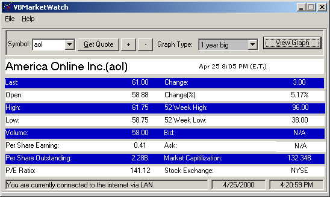



## VBMarketWatch

### Description

Check current stocks on any exchange if you know the ticker symbol.

This code is a direct spin off of another project I found here on PSC called quickquoter. I downloaded it a few weeks ago and made some improvements and wrote the author (Zaid) and asked him if I could re-upload it with the new changes. He said no. So I decided I would rewrite it without using his ocx control.

That is not the only change. You can now save favorite symbols, print the graphs, check online status, even knows if your on a LAN, proxy, dialup, etc. I also spruced up the form a bit, though it mostly still looks like his form. Anyway, now that I am not using his ocx anymore you may all downlaod at your hearts content. Thanks to Fish for the help and to Zen for the icon and avi.

rokinroj@jps.net

icq - 2354342
 
### More Info
 

             |
---                |---
**Submitted On**   |2000-04-26 09:17:36
**By**             |[Rokinroj ](https://github.com/Planet-Source-Code/PSCIndex/blob/master/ByAuthor/rokinroj.md)
**Level**          |Intermediate
**User Rating**    |4.8 (92 globes from 19 users)
**Compatibility**  |VB 5\.0, VB 6\.0
**Category**       |[Complete Applications](https://github.com/Planet-Source-Code/PSCIndex/blob/master/ByCategory/complete-applications__1-27.md)
**World**          |[Visual Basic](https://github.com/Planet-Source-Code/PSCIndex/blob/master/ByWorld/visual-basic.md)
**Archive File**   |[CODE\_UPLOAD52274262000\.zip](https://github.com/Planet-Source-Code/rokinroj-vbmarketwatch__1-7580/archive/master.zip)

